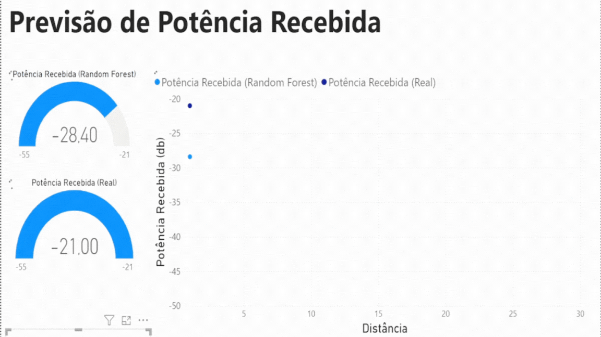

    

# Previsão de Potência Recebida

## Acesso Rápido
- [Sobre](#sobre-o-projeto)
- [Por que utilizar ML](#por-que-utilizar-ml)
- [Organização](#organização)
- [Ferramentas](#ferramentas)
- [Contribuições](#contribuições)
- [Modelos Treinados (2 GHz)](/2-4%20GHz%20Analysis/models/)
- [Modelos Treinados (5 GHz)](/5-2%20GHz%20Analysis/models/)
- [Licença](#licença)

## Sobre o Projeto

    

## Por que utilizar ML?

## Organização

## Ferramentas

## Contribuições

## Licença

